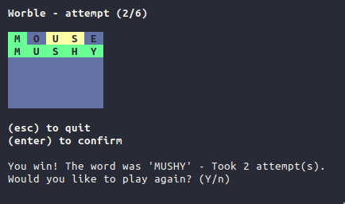

# Worble

 



A simple [Wordle](https://www.nytimes.com/games/wordle/index.html) clone built with pure bash.


## Try it out!

```sh
$ bash <(curl -s https://raw.githubusercontent.com/Cyan903/Worble/main/worble)
```

## Usage

```sh
$ worble help
$ worble ./path/to/custom-word-bank

# Show the word before starting the game
$ CHEAT=1 worble

$ make check
$ make dev
```

## License

[MIT](LICENSE)

